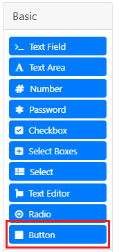
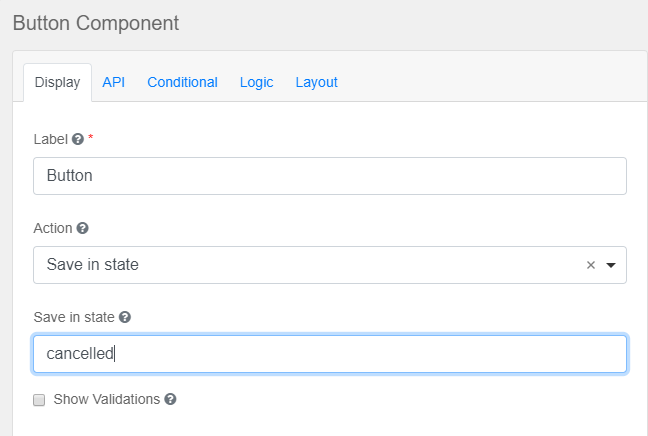
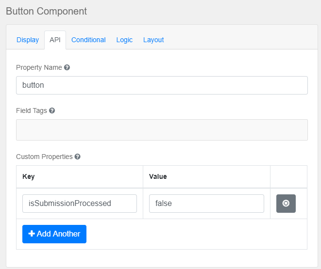

# Formio

Formio is a module that provides an implementation of [FormClient] interface called [FormioClient]. This implementation is based on [Form.io] form management platform.

## How It Works

### Getting form with data

When a form is requested `FormioClient` returns it with data which is in a system and matches to the form fields. The form can be taken from two places
in accordance to used resource loader. By default `FormioClient` loads forms and other resources from web context.

### Making the decision to process submission

`FormClient` can make the decision if the submitted data should be processed (i.e. go through the whole validation lifecycle) or not. `FormioClient` makes this decision in
accordance to `state` field which is in the submitted data. `state` field is passed by [Form.io Button Component] that has property `isSubmissionProcessed` set to boolean value.
Basing on passed `state` `FormioClient` checks out corresponding `isSubmissionProcessed` value in the button definition and makes the decision whether submission should be processed or not.

### Validation

If the decision to process submission is true then the next step is to pass validation (a.k.a `dryValidationAndCleanUp`). To perform this validation `FormioClient` requests [Form.io] engine
which is executed in a nodejs server that is run as an external process using OS's API. It not only validates data but also removes those fields from the data that does
not correspond to form fields. As [Form.io] engine does not return values that match disabled fields on a form, they are set explicitly.

## Installation

1. [Download](https://nodejs.org/) and install NodeJs server. To check if it is installed correctly run `node -v && npm -v`.

1. Run `npm install -g jsdom jsdom-global formio.js`.

1. Set `npm root -g` value to `NODE_PATH` environment variable.

## Usage

1. Open `pom.xml` of your maven project. 
1. Add the repository:
    ```xml
    <repository>
        <id>artezio</id>
        <url>https://nexus.artezio.net/repository/maven-releases</url>
    </repository>
    ```

1. Add the dependency:
    ```xml
    <dependency>
       <groupId>com.artezio.forms</groupId>
       <artifactId>formio</artifactId>
       <version>{formio.version}</version>
    </dependency>
    ```
 
1. [Download Formio Modeler] and install [Formio Modeler].

1. Create a form using [Formio Modeler] (see [Creating Forms]).

1. If you need to have an opportunity to cancel process evaluation and skip validation, you have to provide
info about submission state:
    1. Add `Button` to the form you are creating
       
    
       
    2. In an opened window on `Display` page choose `Action` equal to `Save in state` and give a name to the state that
             will be passed (e.g. `cancelled`)
       
    
       
    3. On `API` page add custom property with the name `isSubmissionProcessed` and set the boolean value (e.g. `false`)
       
    
       
    4. Save settings
       
After that the `state` variable will be passed with the rest form fields and in accordance to the value of `isSubmissionProcessed`
variable the validation will either be performed or not. 

[Creating Forms]: https://help.form.io/userguide/forms/#creating-a-form
[Download Formio Modeler]: https://github.com/Artezio/FormIO-Modeler/releases
[Formio Modeler]: https://github.com/Artezio/FormIO-Modeler#installation
[FormClient]: src/main/java/com/artezio/forms/FormClient.java
[FormioClient]: src/main/java/com/artezio/forms/formio/FormioClient.java
[Form.io Button Component]: https://help.form.io/userguide/form-components/#button
[Form.io Form Schema]: https://github.com/formio/formio.js/wiki/Form-JSON-Schema
[Form.io]: https://form.io
