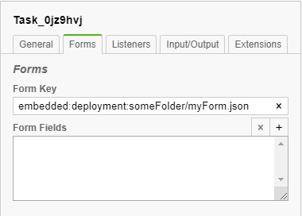

# camunda-formio

Camunda-formio is module that provides an implementation (`FormioClient`) of [FormClient] interface based on [Form.io] form management platform.
[ART-BPMS-REST] uses it as a default implementation.

## How It Works

### Getting form with data

When a form is requested `FormioClient` returns it with data which is already in a process. The form can be taken from two places in accordance to used form type.
`FormioClient` supports [Camunda Embedded Form Types]: `embedded:app` and `embedded:deployment`. It means that once `FormioClient` is asked for a form it checks the
prefix and then returns the form either from `org.camunda.bpm.engine.RepositoryService`, if `embedded:deployment` is specified or from the application's web resources,
if `embedded:app` or nothing is specified. Returned form is in form of [Form.io Form Schema], as `FormioClient` uses [Form.io] engine under the hood. Also if there are
process variables matching to the form fields in the process, they are returned.

### Making the decision to process submission

After data is submitted [ART-BPMS-REST] requests `FormClient` to make the decision if the data should be processed (validated) or not. `FormioClient` makes this decision in
accordance to `state` ffield which is in the submitted data. `state` field is passed by [Form.io Button Component] that has property `isSubmissionProcessed` set to boolean value.
Basing on passed `state` `FormioClient` checks out corresponding `isSubmissionProcessed` value in the button definition and makes the decision whether submission should be processed or not.

### Validation

If the decision to process submission is true then the next step is to pass validation (a.k.a `dryValidationAndCleanUp`). To perform this validation `FormioClient` requests [Form.io] engine
which is executed in a nodejs server that is run as an external process using OS's API. It not only validates data but also removes those fields from the data that does
not correspond to form fields. As [Form.io] engine does not return values that match disabled fields on a form, they are set explicitly.

## Installation

If you use docker for [ART-BPMS-REST], you do not need to do any additional setup. But in case of manual installation you need
a NodeJs server:

1. [Download](https://nodejs.org/) and install NodeJs server. To check if it is installed correctly run `node -v && npm -v`.

1. Run `npm install -g jsdom jsdom-global formio.js`.

1. Set `npm root -g` value to `NODE_PATH` environment variable.

## Usage

Basically you do not need to do anything to enable camunda-formio in [ART-BPMS-REST] because it is already used in one.
But if for some reason you need to do it, follow these steps:

1. Open `pom.xml` of `bpms-rest` module. 

1. Add the maven repository:

    ```xml
    <repositories>
        <repository>
            <id>maven-releases</id>
            <url>https://nexus.artezio.net/repository/maven-releases</url>
        </repository>
        ...
    </repositories>
    ```

1. Add the dependency:
    ```xml
    <dependency>
       <groupId>com.artezio.camunda</groupId>
       <artifactId>formio</artifactId>
       <version>{formio.version}</version>
       <exclusions>
           <exclusion>
               <groupId>com.fasterxml.jackson.core</groupId>
       		   <artifactId>jackson-databind</artifactId>
       	   </exclusion>
       </exclusions>
    </dependency>
    ```
 
1. [Download](https://github.com/Artezio/FormIO-editor) and install [FormioBuilder].

1. Create a form using [FormioBuilder] (see [Creating Forms]).

1. If you need to have an opportunity to cancel process evaluation and not to perform validation, you have to provided date about submission state.
    * Add `Button` to the form you are creating
    
    
    
    * In an opened window on `Display` page choose `Action` equal to `Save in state` and give a name to the state that the button will pass (e.g. `cancelled`)
    
    
    
    * On `API` page add custom property with the name `isSubmissionProcessed` and set the boolean value (e.g. `false`)
    
    
    
    * Save settings
    
    After that `state` variable will be passed with the rest form fields.

1. On a process diagram `formKey` referring to the created form may have a name either without prefix or with one of these: `embedded:deployment:` and `embedded:app:`. If `formKey` does not have the prefix or has `embedded:app:` `FormioClient` will look up the form in web resources of the application. If the `formKey` has `embedded:deployment:` prefix, `FormioClient` will look up
the form in a [Camunda] deployment. Example:

    

[ART-BPMS-REST]: https://github.com/Artezio/ART-BPMS-REST
[Camunda]: https://docs.camunda.org/
[Camunda Embedded Form Types]: https://docs.camunda.org/manual/7.10/user-guide/task-forms/#embedded-task-forms
[Creating Forms]: https://help.form.io/userguide/forms/#creating-a-form
[FormioBuilder]: https://github.com/Artezio/FormIO-editor
[FormClient]: https://github.com/Artezio/ART-BPMS-REST#form-client
[Form.io Button Component]: https://help.form.io/userguide/form-components/#button
[Form.io Form Schema]: https://github.com/formio/formio.js/wiki/Form-JSON-Schema
[Form.io]: https://form.io
